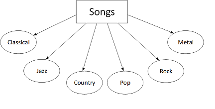
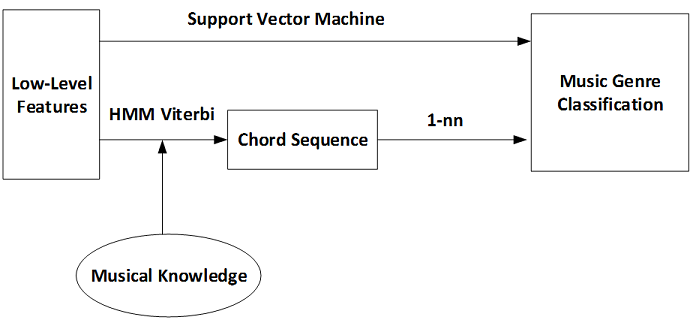
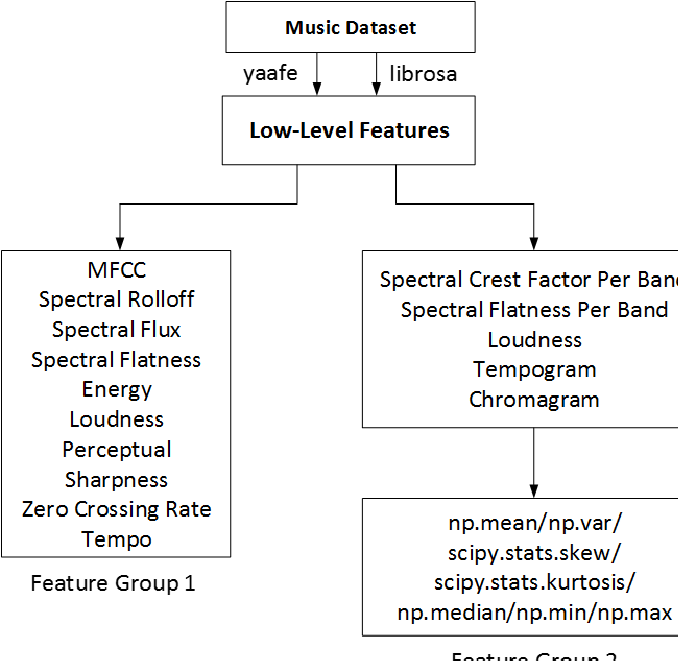
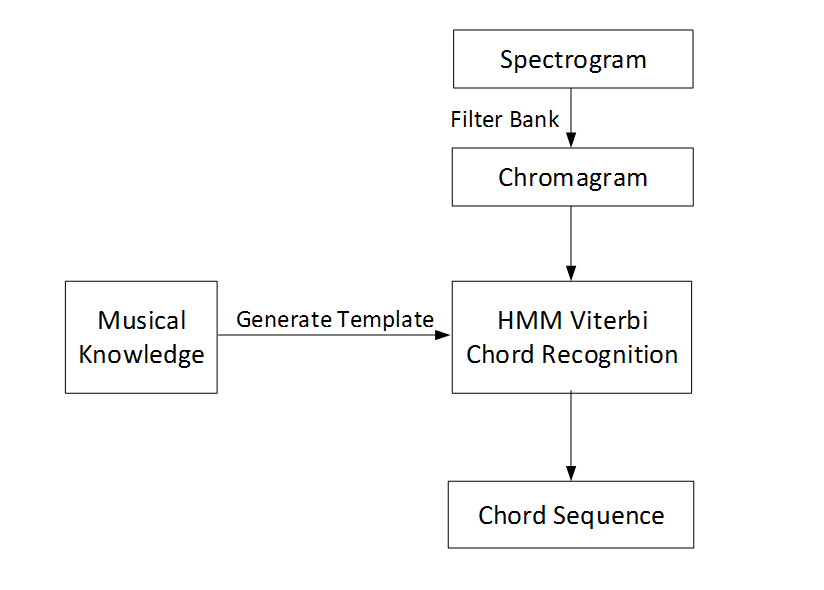
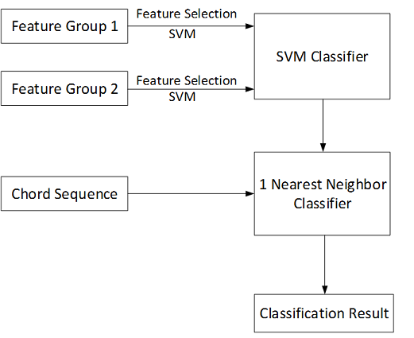

# music-genre-classification-and-chord-sequence

###Motivation

###Proposed Solution

#####For 1-nn, Distance = 1/Length(longest common subsequence)

###Features Extraction
####Low Level Features

####Chord Sequence

###Feature Selection and Classification

